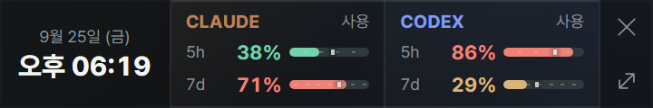

  

  

<h1 align="center">AI 에이전트 사용량 모니터</h1>

<b>Claude와 Codex의 사용량 한도를 윈도우 트레이에서 바로 확인하세요.</b>

  
  
  
  
  
  

  
  

---

## ✨ 주요 기능

* **설치 없이 바로:** 단일 EXE를 원하는 폴더에 두고 실행하면 끝입니다. 지우려면 EXE와 설정 파일만 삭제하면 됩니다.
* **별도 설정 없음:** Claude Code와 Codex에 로그인되어 있다면 그대로 인증됩니다. API 키를 입력할 필요가 없습니다.
* **실시간 트레이 아이콘:** 남은 사용량을 막대나 퍼센트로 보여 주고, 마우스를 올리면 한도별 수치와 초기화 시점을 알려 줍니다.
* **Claude·Codex 상세 팝업:** 계정과 플랜, 세션·주간 한도, 추가 사용량, 초기화 시점을 한 화면에서 전환하며 봅니다.
* **모델별 토큰 상세:** 화살표가 있는 한도 카드를 누르면 로컬 세션 기록으로 계산한 토큰 사용량과 모델별 비율이 펼쳐집니다.
* **한 줄 바 모드:** 시계 옆에 두 에이전트의 기간별 사용률을 한 줄로 띄워 둡니다. 카드를 누르면 그 에이전트만 남은 비율로 바뀌고, `사용`/`남음` 표시로 지금 보이는 숫자가 어느 쪽인지 바로 알 수 있습니다.
* **설치 버전 확인:** CLI와 IDE 확장에 설치된 Claude Code·Codex 버전과 공식 변경 내역을 바로 확인합니다.
* **스마트 알림:** 임계값이나 추가 결제 금액을 넘으면 알리고, 자리를 비운 동안의 알림은 돌아왔을 때 보여 줍니다.
* **이벤트 명령:** 한도 초기화, 임계값 초과, 앱 시작, 아이콘 더블 클릭 때 원하는 명령을 창 없이 실행합니다.
* **시간 대비 사용률:** 경과 시간보다 빠르게 쓰고 있으면 붉게, 여유가 있으면 녹색으로 표시합니다.
* **알아서 도는 갱신:** 기본 1분마다 갱신하고 팝업을 닫아 두면 조회를 멈춥니다. 세션이 만료되면 토큰도 자동으로 갱신합니다.
* **창 하나로 끝나는 자동 업데이트:** 새 버전이 나오면 변경 내역과 진행 단계를 보여 주고, 검증·교체 후 앱을 다시 실행합니다. 문제가 생기면 이전 버전으로 되돌립니다.
* **다국어와 다중 계정:** 한국어·영어·일본어를 시스템 언어에 맞춰 적용하고, `--config-dir`로 여러 Claude 계정을 함께 봅니다.
* **내 방식대로:** 트레이 표시 대상, 새로고침 주기(1·3·5분), 보기 모드를 기억하고, 색과 표시 항목은 설정 파일로 바꿀 수 있습니다.

---

## 🚀 시작하기

1. [최신 릴리스](https://github.com/deuxdoom/usage-monitor-for-claude/releases/latest)에서 `AIAgentsUsageMonitor.exe`를 받아 원하는 폴더에 둡니다.
2. 실행한 뒤 트레이 아이콘을 클릭해 팝업을 엽니다.

**요구 사항:** Windows 10/11 (64비트), 로그인된 Claude Code. Codex 화면에는 ChatGPT로 로그인한 Codex CLI 또는 IDE 확장이 필요합니다.

| 동작 | 결과 |
|---|---|
| 아이콘에 마우스 오버 | 사용량과 초기화 시점 툴팁 |
| 좌클릭 | 상세 팝업 열기 |
| 우클릭 | 트레이 표시 대상, 새로고침 주기, 자동 실행, 종료 |
| 팝업 상단 `Claude` / `Codex` | 보고 있는 에이전트 전환 |
| 팝업의 보기 전환 버튼 | 상세 보기와 바 모드 전환 |
| 사용량 카드 클릭 | 토큰 사용량과 모델별 비율 펼치기 |
| 바 모드 카드 클릭 | 그 에이전트만 사용한 비율 / 남은 비율 전환 |
| 계정 이름 클릭 | 가려 둔 이메일 보이기 / 숨기기 |

> **💡 트레이 아이콘이 보이지 않나요?** 작업 표시줄 설정의 '시스템 트레이 아이콘'에서 **AIAgentsUsageMonitor**를 켜 주세요.

---

## 🔒 보안 및 투명성

이 앱은 Claude Code의 OAuth 토큰을 읽고 Codex에 한도 조회를 맡기므로, 무엇을 읽고 어디로 보내는지를 모두 공개합니다.

* **네트워크:** Claude 사용량은 `api.anthropic.com`에서 조회합니다. 새 버전 확인은 `api.github.com`의 공개 릴리스 정보만 읽고, EXE는 "지금 업데이트"를 누른 경우에만 GitHub에서 받습니다. 여기에 계정 정보나 토큰을 보내지 않습니다. Codex 계정과 한도는 설치된 Codex의 공식 App Server가 조회하며, 이 자식 프로세스의 분석 전송과 OpenTelemetry 내보내기는 끄고 모델 실행이나 프롬프트 전송은 하지 않습니다.
* **로컬 기록:** 모델별 토큰 상세는 로컬 세션 기록(Claude Code, 그리고 `CODEX_HOME` 또는 `~/.codex`)을 읽어 계산하며 외부로 보내지 않습니다. 다른 기기나 WSL 안의 기록은 집계되지 않습니다.
* **인증 정보:** Claude 토큰은 조회 헤더에만 쓰고 기록하거나 전송하지 않습니다. Codex 인증 파일은 직접 읽지 않습니다.
* **앱이 쓰는 파일:** 설정 파일(`config.json`)에는 트레이 표시 대상·새로고침 주기·보기 모드 세 가지만 저장하고, 다른 키와 읽을 수 없는 파일은 건드리지 않습니다. 새 버전이 있으면 업데이트 창용 EXE 복사본을 임시 폴더에 만들고 "나중에"를 누르면 바로 지웁니다. 업데이트 중에는 EXE 옆에 다운로드 파일과 이전 EXE 백업을 잠시 만들었다가 끝나면 지웁니다. 레지스트리에는 알림 등록과 자동 실행 항목만 남기며, 조회를 맡은 Codex는 평소처럼 자체 로그와 인증 정보를 기록할 수 있습니다.

자세한 내용은 [PRIVACY.md](PRIVACY.md)에 있습니다.

---

## 📚 문서

설정 파일을 직접 만들 필요는 없습니다. 더 세밀하게 바꾸고 싶다면 [docs/](docs/)를 참고하세요.

* [설정 항목](docs/configuration.md) - 설정 파일 위치와 저장 방식, 직접 바꿀 수 있는 값
* [이벤트 명령](docs/event-commands.md) - 한도 초기화나 임계값 초과 때 명령 실행하기
* [앱 자동 업데이트](docs/automatic-update-check.md) - 새 버전 확인, 업데이트 창, 검증·교체와 자동 재실행
* [Claude API](docs/claude-api-reference.md) / [Codex API](docs/codex-api-reference.md) - 두 에이전트의 사용량을 어디에서 어떻게 읽는지

---

## 📄 라이선스

MIT. 포함된 글꼴과 아이콘의 라이선스는 [LICENSE](LICENSE)에 있습니다.

*커뮤니티에서 독립적으로 만든 오픈소스 앱이며, Anthropic 또는 OpenAI의 공식 지원을 받지 않습니다.*
