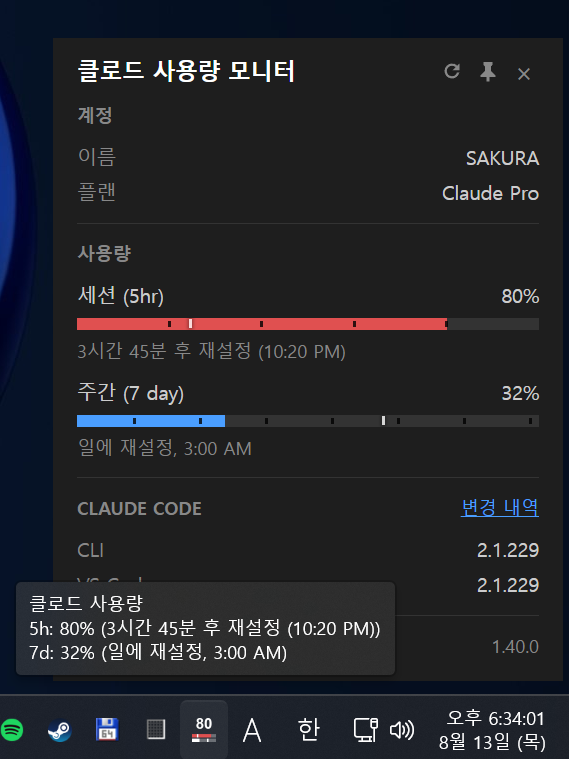

# Claude 사용량 모니터
[](https://github.com/deuxdoom/usage-monitor-for-claude/releases/latest)
[](https://github.com/deuxdoom/usage-monitor-for-claude/releases/latest)
[](https://github.com/deuxdoom/usage-monitor-for-claude/releases)
[](https://opensource.org/licenses/MIT)  
[](https://github.com/deuxdoom/usage-monitor-for-claude)
[](https://www.python.org/)
[](https://claude.ai/)
[](https://github.com/deuxdoom/usage-monitor-for-claude)
---

**윈도우 시스템 트레이에서 실시간으로 클로드 사용량 제한을 확인하세요.**

설치가 필요 없는 가벼운 윈도우 네이티브 트레이 앱입니다. 
claude.ai, Claude Code, VS Code 및 JetBrains 확장 프로그램 등에서 공유되는 사용량 제한을 한눈에 보여줍니다. 
세션 및 주간 한도(Sonnet, Opus, Fable 등)가 얼마나 남았는지 항상 파악할 수 있습니다.



## ✨ 주요 기능

* **포터블 (무설치):** 16MB 용량의 단일 EXE 파일로, 다운로드 후 바로 실행할 수 있습니다. 삭제하려면 파일을 지우기만 하면 됩니다.
* **제로 구성 (Zero Configuration):** 기존 Claude Code 로그인을 통해 자동으로 인증되므로, API 키를 따로 입력할 필요가 없습니다.
* **실시간 트레이 아이콘:** 트레이 아이콘에 진행률 표시줄이나 퍼센트 수치로 남은 사용량을 직관적으로 보여줍니다.
* **상세 팝업 기능:** 트레이 아이콘을 클릭하면 계정 정보와 활성화된 모든 할당량(세션, 주간 한도 등), 추가 사용량, 초기화 남은 시간 등을 상세히 볼 수 있습니다. 수동 새로고침 버튼과 핀 고정 기능도 제공합니다.
* **세션/주간 상세 정보:** 세션 또는 주간 사용량 바를 클릭하면 정확한 토큰·메시지 사용량과 모델별 사용 비율(예: Sonnet 96.6% / Opus 3.4%)을 확인할 수 있습니다. API가 제공하지 않는 실제 수치를 로컬 Claude Code 세션 기록에서 직접 읽어옵니다. 단, 이 기록은 **Claude Code 사용분만** 담고 있어 claude.ai 웹이나 데스크톱 앱 사용분은 집계되지 않습니다(퍼센트 표시에는 모두 반영됩니다).
* **설치된 Claude Code 버전 확인:** CLI, VS Code 등 각 환경에 설치된 버전을 팝업에서 바로 확인할 수 있습니다.
* **스마트 알림:** 설정한 사용량 임계값이나 금액(추가 결제 한도)을 초과할 때 알림을 받을 수 있습니다.
* **시간 마커 표시:** 현재 기간 내에 경과한 시간을 바(bar)에 표시하여, 시간 대비 사용량이 많을 경우 진행률이 빨간색으로 경고해 줍니다.
* **자동 토큰 갱신:** 세션이 만료되면 백그라운드에서 자동으로 토큰을 갱신합니다.
* **다중 계정 지원:** `--config-dir` 설정을 통해 여러 Claude 계정을 동시에 모니터링할 수 있습니다.
* **다국어 지원:** 한국어를 포함한 13개 언어를 지원하며 윈도우 시스템 언어에 맞춰 자동 적용됩니다.

---

## 🔒 보안 및 투명성

이 앱은 사용자의 Claude Code OAuth 토큰을 사용하므로 보안이 가장 중요합니다.

* **단일 네트워크 통신:** 오직 `api.anthropic.com`과 통신하며, 다른 서버로 데이터를 보내지 않습니다.
* **로컬 세션 기록 읽기:** 세션/주간 상세 정보(토큰·모델 통계)는 사용량 바를 클릭했을 때만 로컬 Claude Code 세션 기록을 읽어 계산하며, 이 데이터는 외부로 전송되지 않습니다.
* **로컬 보안:** 토큰은 외부로 전송되거나 기록되지 않습니다.
* **디스크 쓰기 없음:** 파일 시스템에 어떤 파일도 생성하지 않으며, 윈도우 레지스트리에 알림 및 자동 시작 정보만 최소한으로 등록합니다.

---

## 💻 요구 사항

* **Windows 10 또는 Windows 11 (64비트)**
* **Claude Code 설치 및 로그인 필수:** 이 앱은 Claude Code가 로컬에 저장한 인증 토큰을 읽어와 작동합니다.

---

## 🚀 시작하기

별도의 설치가 필요 없습니다. 최신 릴리즈의 `UsageMonitorForClaude.exe`를 다운로드하여 원하는 폴더에 넣고 실행하기만 하면 됩니다. 

### 기본 사용법

| 동작 | 결과 |
|---|---|
| **아이콘에 마우스 오버** | 툴팁으로 사용량 퍼센트 및 초기화 시간 표시 |
| **좌클릭** | 계정 정보 및 상세 사용량 팝업 열기 |
| **우클릭** | 팝업 열기, 윈도우 시작 시 자동 실행 켜기/끄기, 종료 등의 메뉴 열기 |
| **새로고침 버튼 (팝업 내)** | 다음 자동 갱신을 기다리지 않고 즉시 데이터 가져오기 |
| **팝업에서 세션/주간 사용량 바 클릭** | 정확한 토큰·메시지 수와 모델별 사용 비율 표시 (다시 클릭하면 접힘) |
| **팝업에서 계정 이름 클릭** | 숨겨져 있던 이메일 주소 보이기 / 숨기기 |

> **💡 트레이 아이콘이 보이지 않나요?**
> 윈도우가 기본적으로 새 아이콘을 숨길 수 있습니다. 작업 표시줄을 우클릭하여 설정에 들어간 뒤, '시스템 트레이 아이콘' 설정에서 **UsageMonitorForClaude**를 켬(On)으로 변경해 주세요.

---

## ⚙️ 설정 (선택 사항)

앱은 기본 설정으로도 완벽하게 작동하지만, 설정을 커스텀하고 싶다면 실행 파일과 같은 위치에 `usage-monitor-settings.json` 파일을 만들어 원하는 값만 덮어쓸 수 있습니다. 

*예시:*
```json
{
  "poll_interval": 180,
  "bar_fg": "#00cc66",
  "bar_fg_warn": "#ff6600"
}
```

## 📄 라이선스

MIT

*이 프로젝트는 커뮤니티에서 독립적으로 만든 오픈소스 앱이며, Anthropic의 공식 지원을 받지 않습니다.*

---

[](https://github.com/jens-duttke/usage-monitor-for-claude/discussions/categories/ideas)
[](https://github.com/sponsors/jens-duttke)